# Using Claude in a Real Project

                    

---

## 1. Recap: Text in, text out

A language model is a magic box.

**Text goes in. Text comes out.**

```mermaid
graph LR
    A[Text In] --> B["🪄 Language Model"]
    B --> C[Text Out]
```

No matter what we build on top, this is all that's happening.

                    

---

## 2. Recap: The conversation simulation

We learned how to simulate an ongoing conversation — pass the whole conversation back in each time.

```mermaid
graph LR
    A["📝💬📝💬📝 Conversation so far"] --> B["🪄 Language Model"]
    B --> C["💬 Next reply"]
```

Still just text in, text out. We're just building up the input.

                    

---

## 3. Recap: The harness

Claude Code is a **harness** — a program that lets the model take actions on your computer.

```mermaid
graph TD
    A["Input"] --> B["🪄 Model"]
    B --> C["Tool text"]
    C --> D["👀 Watcher Program"]
    D --> E["Performs action on computer"]
    E --> F["Result of action"]
    F --> B
```

Conversation + tool calls = a model that can drive your computer.

                    

---

## 4. But how do you apply this to a real project?

We've learned what Claude is. We've experimented with it.

But how do you actually use it — **systematically** — to build and transform real software?

                    

---

## 5. The key principle: Don't gamble

The most important principle for using Claude in a real project:

**We are not gambling.**

                    

---

## 6. What is gambling?

You take an action. The reward is **unpredictable**.

- Sometimes high reward
- Sometimes low reward
- Sometimes nothing

You don't know what you're going to get.

This triggers a specific brain circuitry — one that can become **deeply addictive**.

                    

---

## 7. Gambling is everywhere

🎰 **Slot machines** — pull the lever, maybe you win, maybe you don't.

📱 **Internet feeds** — swipe up, maybe you get a hit, maybe you get a miss.

The mechanic is the same: take an action, get an unpredictable reward, develop a compulsion to pull the lever again.

                    

---

## 8. You don't control the outcome

The crucial thing about gambling:

**You don't control what comes out.**

The system has baked-in odds. You pull the lever and hope. You're at the mercy of the machine.

                    

---

## 9. Using Claude naively is gambling

```mermaid
graph LR
    A["🙏 A prompt"] --> B["🪄 Language Model"]
    B --> C["❓ Good output?"]
```

You write a prompt. You don't know if it's the right prompt. You don't know if it gives Claude the context it needs.

You pull the lever and hope.

                    

---

## 10. If you can't predict the output, you're not in control

As models get better, you win more often. But you also raise the difficulty ceiling — so you're always chasing the next winning hand.

- You might feel a **compulsion** to keep building without being able to predict quality
- If you can't predict quality, you can't control whether you deliver on time, to spec, or at the right bar

**Unpredictable output = you're not driving. The machine is.**

So how do we change that?

                    

---

## 11. How do you bend the odds?

How do you get **predictably good output** from Claude in complex software engineering projects?

How do you steer Claude toward your goals without just rolling the dice?

                    

---

## 12. Principles first, systems second

We're going to look at a specific system developed by a team that's been shipping production code this way for months.

But first, the **principles behind it** — four ideas that make the whole thing work:

1. **Context is your only lever**
2. **Compaction turns noise into signal**
3. **Sub-agents keep your context clean**
4. **Human attention belongs at the top of the pipeline**

                    

---

## 13. Principle 1: Context is the only lever

Remember: each turn is a **stateless function call**. The model has no memory between turns.

```mermaid
graph LR
    A["Context Window"] --> B["🪄 Model"]
    B --> C["Next step"]
```

The context window is the **only thing** that determines output quality. There is no other lever.

                    

---

## 14. So what threatens your context?

Every action the model takes **fills the window**:

```mermaid
graph RL
    S["🔍 Searching for files"] --> CW["📦 Context Window<br/>~170k tokens"]
    U["📖 Reading & understanding code"] --> CW
    E["✏️ Applying edits"] --> CW
    T["🧪 Test & build logs"] --> CW
    J["📋 Tool results & JSON blobs"] --> CW
```

Most of this is **noise** — useful to the model in the moment, but dead weight afterwards.

                    

---

## 15. Principle 2: Compaction turns noise into signal

**Compaction** = pausing to distill what you've learned into a structured artifact, then starting fresh.

```mermaid
graph LR
    subgraph Before
        A["🔍🔍🔍📖📖✏️🧪❌🧪✅"]
    end
    subgraph After
        B["📄 Clear summary of findings,<br/>status, and next steps"]
    end
    Before -->|compact| After
```

Instead of dragging all that noise forward, you carry a **clean, dense summary** into a new conversation.

In practice: end the conversation, start a new one, load only the artifact. Keep utilization in the **40-60% range**.

                    

---

## 16. Principle 3: Sub-agents keep your context clean

A sub-agent gets its own **fresh context window** to search, read, and explore — without polluting the parent's context.

```mermaid
graph TD
    P["🧠 Parent Agent<br/>(clean context)"] -->|"go find X"| S["🔍 Sub-Agent<br/>(fresh context window)"]
    S -->|"here's what I found<br/>(structured summary)"| P
```

The parent stays clean. The sub-agent does the messy work and returns a **compacted result**.

                    

---

## 17. The three-phase workflow

Principles 1-3 lead to a natural workflow structure:

```mermaid
graph LR
    R["🔍 Research"] -->|compact| P["📋 Plan"]
    P -->|compact| I["🔨 Implement"]
```

**Research** — Understand the codebase. Find the relevant files. Map the information flow.

**Plan** — Outline exact steps. Specify files to edit. Define how to verify each phase.

**Implement** — Step through the plan. Compact progress after each phase.

Each transition is a **compaction point** — a fresh context loaded with only what matters.

                    

---

## 18. Principle 4: Human attention belongs at the top

Bad code is bad code. But bad plans spawn **hundreds** of bad lines. Bad research spawns **thousands**.

```mermaid
graph LR
    R["🔍 Research"] --> P["📋 Plan"] --> I["🔨 Implement"]

    R -.- RH["🧑 High leverage review"]
    P -.- PH["🧑 High leverage review"]
    I -.- IH["🧑 Lower leverage review"]

    style RH fill:#ff9,stroke:#333,color:#333
    style PH fill:#ff9,stroke:#333,color:#333
    style IH fill:#ddd,stroke:#333,color:#333
```

Focus your attention on **research and plans** — that's where a small correction has the biggest impact.

                    

---

## 19. A system built on these principles

The system we're using expands the three-phase pattern into **five phases** — each one a command you can run.

```mermaid
graph LR
    subgraph Research + Plan
        S["🔍 Sub-agents"] -->|findings| P["📋 Plan"]
        B["💭 Brainstorm"] -->|compact| P
    end
    subgraph Implement
        W["🔨 Work"]
    end
    subgraph Close the loop
        R["🔍 Review"] --> C["📚 Compound"]
    end

    P -->|compact| W
    W --> R
    C -.->|knowledge feeds back| P
```

Research didn't disappear — it got delegated to **sub-agents** inside the plan phase. Brainstorm captures your intent before planning.

The new piece is **"close the loop"** — use the LLM to check your work, and document what you learned so future sessions start smarter.

**Practical tip:** `/clear` between each step. Each command writes an artifact that the next one finds automatically. Fresh context = compaction in practice.

                    

---

## 20. Brainstorm: Clarify WHAT to build

`/workflows:brainstorm`

Before you write any code, figure out **what you're actually building**.

- Claude asks you questions — one at a time
- Together you explore 2-3 approaches with trade-offs
- Output: a brainstorm document capturing decisions

**Principle: better input = better output.** If you skip this, the model is guessing at your intent. That's gambling.

                    

---

## 21. Plan: Define HOW to build it

`/workflows:plan`

Claude researches the codebase using **sub-agents** — each in a fresh context window.

```mermaid
graph TD
    P["📋 Plan Agent"] -->|parallel| A1["🔍 Repo Researcher"]
    P -->|parallel| A2["🔍 Learnings Researcher"]
    P -->|parallel| A3["🔍 Best Practices"]
    A1 -->|compacted findings| P
    A2 -->|compacted findings| P
    A3 -->|compacted findings| P
    P --> PLAN["📄 Implementation plan<br/>with exact steps"]
```

**Principles: sub-agents + compaction.** The parent context stays clean. Research gets distilled into a structured plan.

                    

---

## 22. Work: Execute the plan

`/workflows:work`

Claude reads the plan and works through it **step by step**.

- Creates a task list from the plan
- Implements each task, following existing patterns
- Verifies each step as it goes
- Checks off steps in the plan document
- Commits incrementally

**Principle: design around context.** The plan is a compact artifact. Claude starts with a clean context loaded with exactly what it needs — not hours of accumulated noise.

                    

---

## 23. Review & Compound: Close the loop

`/workflows:review` — Multi-agent code review, findings ranked by severity.

`/workflows:compound` — Document what you learned for next time.

```mermaid
graph LR
    S["🧠 Solved a problem"] --> D["📄 Document it"]
    D --> K["📚 Knowledge base"]
    K -->|"learnings-researcher<br/>finds it next time"| FP["📋 Future plans"]
```

**Principle: compounding knowledge.** The first time you solve a problem, it's research. The second time, it's a lookup.

                    

---

## 24. Where you come in

This is not autopilot. **You are the driver.**

```mermaid
graph LR
    B["💭 Brainstorm"] -->|"🧑 you guide"| P["📋 Plan"]
    P -->|"🧑 you review"| W["🔨 Work"]
    W --> R["🔍 Review"]
    R -->|"🧑 you decide"| C["📚 Compound"]
```

- You guide the brainstorm — Claude asks, you decide
- You review the plan — catch wrong assumptions early
- You review the output — is this what you wanted?

Your attention goes to the **highest-leverage points** in the pipeline.

                    

---

## 25. Today's project

This repo contains a working **Snake game**.

Your mission: **transform it into a completely different game** using this workflow.

```mermaid
graph LR
    S["🐍 Snake"] -->|"brainstorm → plan → work"| G["🎮 Your Game"]
```

                    

---

## 26. How to start

1. **Explore the repo** — read the code, understand what exists
2. **`/workflows:brainstorm`** — decide what game to build
3. **`/workflows:plan`** — let Claude research the codebase and create a plan
4. **Review the plan** — this is your highest-leverage moment
5. **`/workflows:work`** — execute the plan
6. **Iterate** — review, compound, repeat

Don't gamble. **Drive.**

                    

---

## 27. While Claude is working

Some steps — especially `/workflows:plan` and `/workflows:work` — take a while to run.

**You don't have to wait.** Open a new terminal tab and start a new Claude conversation.

Use that time to:
- Ask Claude questions about the workflow system, the commands, or how things work
- Explore the codebase
- Think about your game design

                    

---
